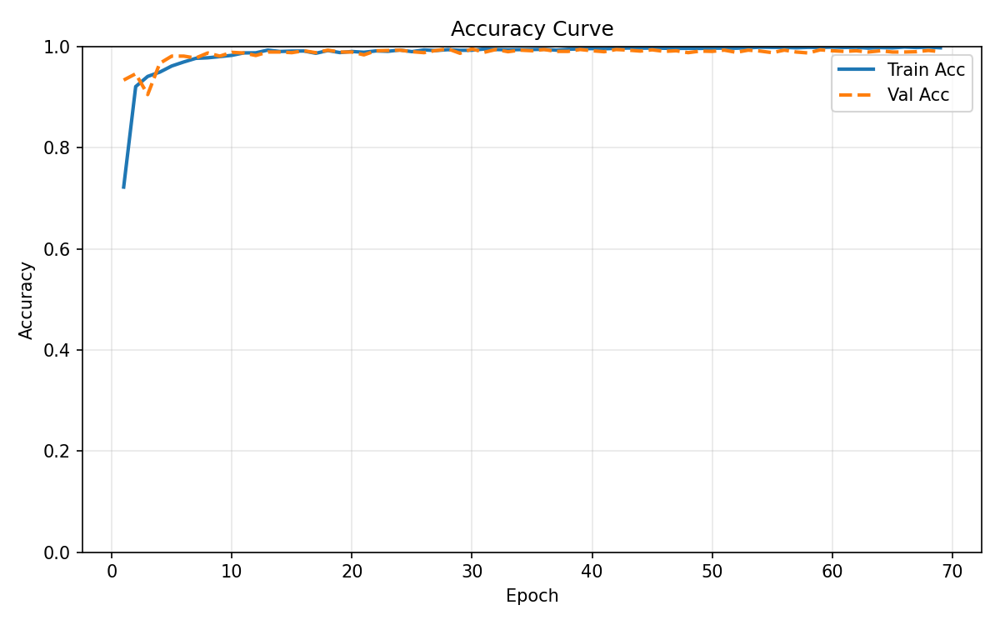
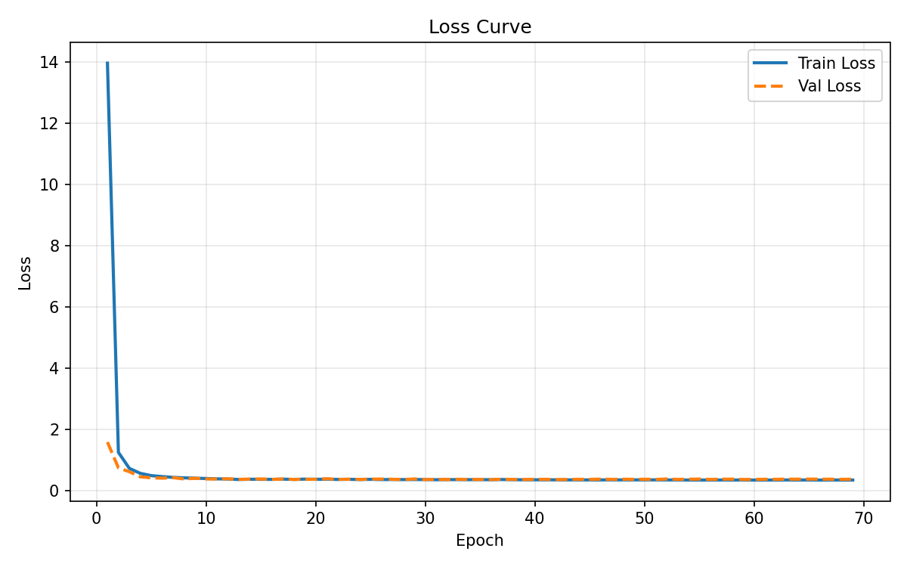
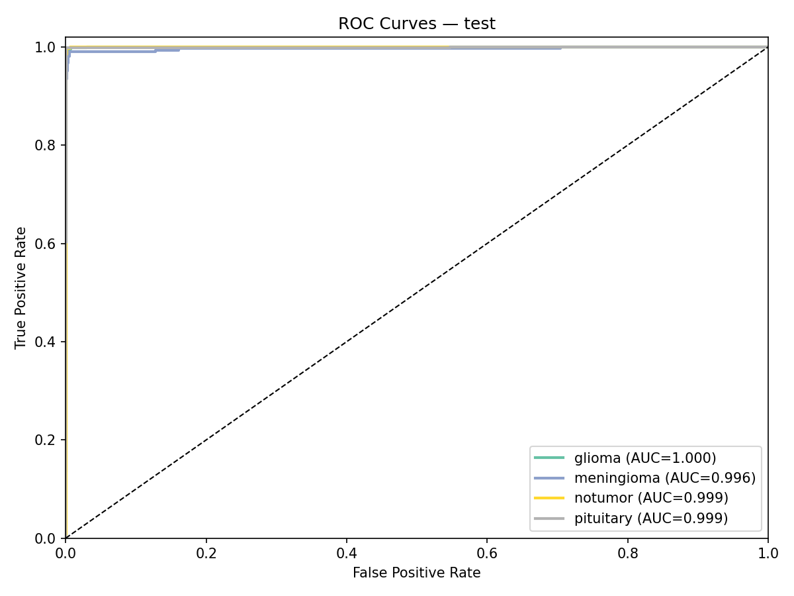
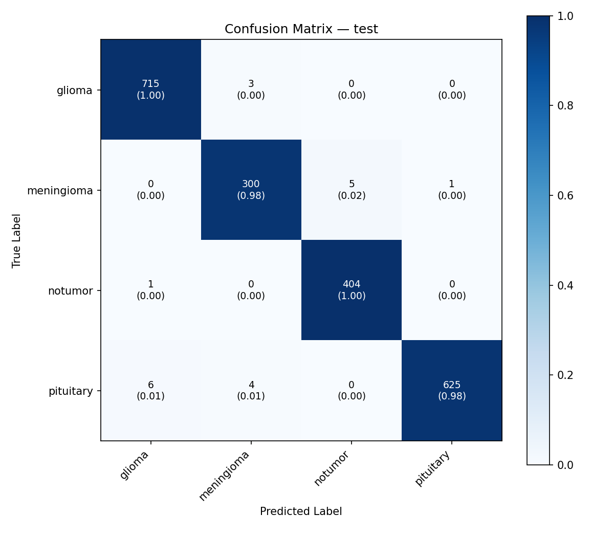

# Tumor Grad-CAM Classification

This repository hosts an advanced Hybrid Neural Network designed for classifying brain classification variants utilizing Magnetic Resonance Imaging (MRI). By combining the spatial extraction reasoning inherent to Convolutional Neural Networks with the global context logic of Transformers, the model operates securely to output predictions confirmed utilizing explicit Grad-CAM mappings per case.

## Architecture Highlights

The structural foundation deploys multiple branches ensuring optimized parameter retention without collapsing under overfitting limitations:

*   **CNN Sub-Network**: Utilizes PyTorch's `EfficientNet-B0` design template parsing hierarchical layers identifying defining edges, shapes, and features from the local scan context arrays.
*   **Transformer Sub-Network**: Incorporates `Swin-Tiny` mechanisms generating structural continuity across separated components of any given volume through critical self-attention systems allowing long-range dependencies recognition.
*   **Channel Attention Fusion Element**: Bipartite inputs (CNN+Swin architectures) do not stack flatly. A structured Channel Attention filter mechanism aligns significance per component to effectively integrate vectors retaining significant variables and shedding artifact features producing a refined unified embedding module.
*   **Prototype Memory Head**: Traditional classifier algorithms lack comparative visualization mappings. Class selection directly references learnable vectors arrayed for classifications (glioma, meningioma, notumor, or pituitary labels) against a configurable temperature gradient scaled by Cosine similarity calculations, identifying likelihood matrices defining class selections structurally.

## Datasets and Class Dispersion

Testing the accuracy variables demands broad and precise initial definitions minimizing data pooling contamination across more than 10,000 distinct samples:

*   **Training Population Size:** 6,420 entries defining basic logic parameters.
*   **Validation Checkpoint:** 1,603 distinct samples retaining logic tracking metrics active throughout epoch calibration.
*   **Benchmark Restraint (Test):** 2,064 independent scan datasets completely quarantined enabling objective test logic and final reporting accuracy verification processes.

Included Category Arrays:
1. `glioma`
2. `meningioma`
3. `notumor` (Malignant features absent)
4. `pituitary`

## Model Performance Benchmarking

Analysis mechanisms run against the quarantined Test population return near-absolute metric scores establishing functional utility mapping for generalized deployments restricting typical noise-bound variance margins.

General Class Results:
*   **Raw Accuracy Base:** 99.03%
*   **Precision Index (Macro):** 98.84%
*   **Recall Index (Macro):** 98.95%
*   **Calculated F1-Score:** 98.89%
*   **Integrated ROC AUC Index:** 0.9986

Specific Class Categorical Logic Results:
*   **Glioma:** 99.58% Accurate Validation Match
*   **Meningioma:** 98.04% Accurate Validation Match
*   **No Tumor Baseline:** 99.75% Accurate Validation Match
*   **Pituitary:** 98.43% Accurate Validation Match 

## Extracted Visualizations Data and Logging Outputs

Running inference triggers exhaustive analytical plotting and detailed categorical matrices available immediately parsing within the resulting file structures automatically.

### Application Graphical Interface

The interactive GUI platform (operated via `python gradcam_app/app.py`) provides direct analytical control allowing transparent evaluation of data samples directly overlaying structural Grad-CAM activation outputs. Users select layers adjusting blend configurations directly.

| GUI Initialization and Image Load | Analysis Inference and Logic Evaluation |
|:---:|:---:|
|  |  |

*(Note: Alpha testing application graphical variants display detailed logical structures alongside interactive scaling.)*

### Analytic Output Metrics

The base path location `results/` includes standard output elements tracking loss ratios, training sequence histories, complete output reports alongside ROC outputs testing variables against precise matching, and the baseline matrix mapping proper categorical sorting metrics.

**Training Performance Curves**
| Accuracy Curve | Loss Component Ratio |
|:---:|:---:|
|  |  |

**Diagnostic Matching Verifications**
| Evaluated ROC Mapping | Output Confusion Matrix |
|:---:|:---:|
|  |  |

### Grad-CAM Graphical Confirmations

Processing visualization routines found sequentially deployed within `results/gradcam/` produce explicit analytical models via LayerCAM protocols. Sample systems automatically capture arrays of four explicit tests representing the four classifications, building composite frames linking the Original MRI arrays adjacent to the explicit Grad-CAM heat mapping structure and rendering the full unified view indicating specific classification focal bounds in alpha overlaid outputs. The `gradcam_summary.png` image matrix assembles all these data comparisons in to a single grid for accessible evaluation. 


## Running Application Instructions 

The architecture deploys automatically running logic utilizing simple procedural logic inputs matching standard tensorboard evaluation methodologies inclusive of Mixed Precision integration structures alongside strict Early Stopping constraints. 

```bash
# Standard Output Test Metrics Processing Execution 
python main.py --eval-only

# Deploy Grad-CAM Interactive Graphic User System Application
python gradcam_app/app.py
```


